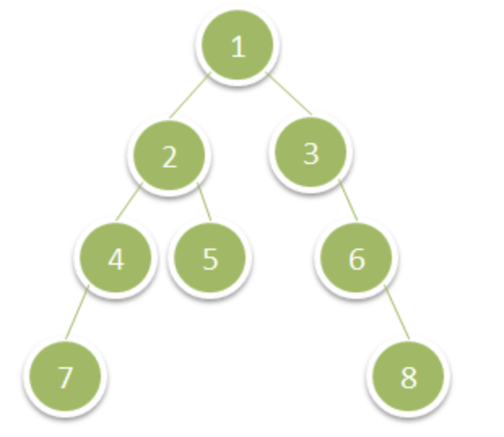

# 1302. Deepest Leaves Sum

Given a binary tree, return the sum of values of its deepest leaves.

 

**Example 1:**



```
Input: root = [1,2,3,4,5,null,6,7,null,null,null,null,8]
Output: 15
```

 

**Constraints:**

- The number of nodes in the tree is between `1` and `10^4`.
- The value of nodes is between `1` and `100`.


# Version1

思路：

用BFS，计算每一层node的和

```cpp
class Solution {
public:
    int deepestLeavesSum(struct TreeNode* root){
        int res = 0;
        queue<TreeNode*> q;		//建立队列
        q.push(root);					//初始节点入队

        while(q.size()) {
            res = 0;
          	//遍历树的一层
            for(int i = q.size() -1; i >= 0; i--) {
                TreeNode* top = q.front(); q.pop();
                res += top->val;
								//孩子入队，准备下一层
                if(top->left) q.push(top->left);
                if(top->right) q.push(top->right);
            }

        }
        return res;
    }
};
```

