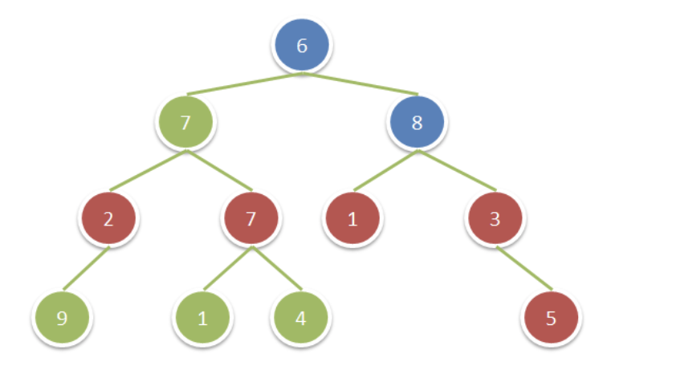

# 1315. Sum of Nodes with Even-Valued Grandparent

Given a binary tree, return the sum of values of nodes with even-valued grandparent. (A *grandparent* of a node is the parent of its parent, if it exists.)

If there are no nodes with an even-valued grandparent, return `0`.

**Example 1:**



```
Input: root = [6,7,8,2,7,1,3,9,null,1,4,null,null,null,5]
Output: 18
Explanation: The red nodes are the nodes with even-value grandparent while the blue nodes are the even-value grandparents.
```

 

**Constraints:**

- The number of nodes in the tree is between `1` and `10^4`.
- The value of nodes is between `1` and `100`.


# Version1

思路：DFS，这题主要需要将grandparent记录下来，parent是一个信息转换的中介。

因此这里创建了一个dfs(TreeNode* root, TreeNode* parent, TreeNode* grandParent)的函数

```cpp
class Solution {
public:
    int res = 0;
    int sumEvenGrandparent(TreeNode* root) {
        dfs(root, NULL, NULL);
        return res;
    }
    
    void dfs(TreeNode* root, TreeNode* parent, TreeNode* grandParent) {
        if(!root) return;
        if(grandParent && grandParent->val % 2 == 0) 
          res += root->val;
        
        dfs(root->left, root, parent);
        dfs(root->right, root, parent);
    }
};
```

