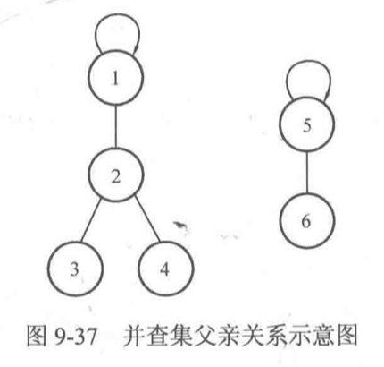
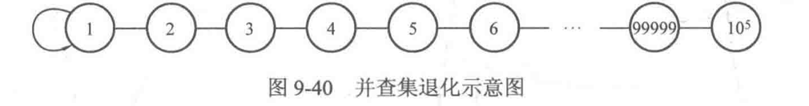
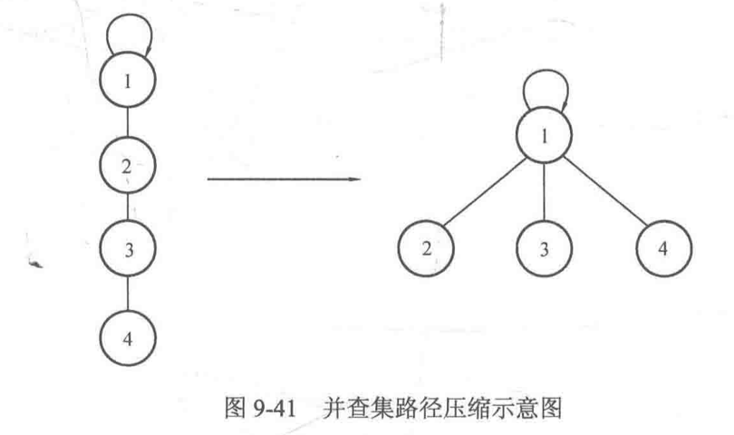

# 并查集

# 1. 并查集的定义

并查集是一种维护集合的数据结构，他的名字中的"并""查"集"分别取自Union, Find, Set这三个单词。也就是说，并查集支持下面两个操作

* 合并：合并两个集合
* 查找：判断两个元素是否在一个集合

并查集实际上就是用一个数组实现的:

```cpp
int father[N];
```

其中，father[i]表示元素i的父亲节点，而父亲节点本身这个集合中的元素$(i\leq i\leq N)$。例如father[1]=2表示元素1的父亲节点是元素2，以这种父系关系来表示元素所属的集合。

如果father[i]==i, 说明元素i是该集合的根节点，但对于同一个集合来说值存在一个根节点，且将其作为所属集合的标识。



```cpp
father[1] = 1; //1的父亲是自己，说明1是根节点
father[2] = 1; //2的父亲是根节点1
father[3] = 2; //3的父亲是节点2
father[4] = 2; //4的父亲是节点2

father[5] = 5; //5的父亲是自己，说明5是根节点
father[6] = 5; //6的父亲是节点5
```

<br>

# 2. 并查集的基本操作

总体来说，并查集的使用需要先初始化father数组，然后再根据需要进行查找或合并操作。

### A. 初始化

一开始，每个元素都是独立的一个集合，因此需要令所有father[i]=i

```cpp
for(int i = 1; i <= N; i++) {
  father[i] = i;	//令father[i] = -1;也可以
}
```

### B. 查找

由于规定同一个集合中只存在一个根节点，因此查找操作就是对给定的节点寻找其根节点的过程。实现的方式可以是递推或是递归。思路就是反复寻找父亲节点，直到找到根节点

递归实现

```cpp
int findFather(int x) {
  if(x == father[x]) return x;
  else return findFather(father[x]);
}
```

循环

```cpp
int findFather(int x) {
  while(x != father[x]) {
    x = father[x];
  }
  return x;
}
```

### C. 合并

合并是把两个集合合并成一个集合，题目中一般给出两个元素，要求把这两个元素所在的集合合并。

实现上一般先判断两个元素是否属于同一个集合，只有当两个元素属于不同集合时才合并，而合并的过程一般是把其中一个集合的根节点的父亲指向另一个集合的根节点。

于是思路就比较清晰了，主要分为以下两步：

1. 对于给定的两个元素a, b, 判断他们是否属于同一集合。可以调用上面的查找函数，对这两个元素a,b 分别查找根节点，然后再判断其根节点是否相同
2. 合并两个集合：在1中已经获得了两个元素的根节点faA与faB, 因此只需要把其中一个的父亲节点指向另一个节点。例如可以令father[faA]=faB, 也可以令father[faB]=fa[A]

```cpp
void Union(int a, int b) {
  int faA = findFather(a);	//查找a的根节点，记为faA
  int faB = findFather(b);	//查找b的根节点，记为faB
  if(faA != faB) {					//如果不属于同一个集合
    father[faA] = faB;			//合并他们
  }
}
```

# 3. 路径压缩

上面的并查集查找函数没有经过优化，在极端情况下效率较低。

考虑一种情况，题目给出的元素数量很多并且形成一条链，那么这个查找函数的效率就会非常低。




我们可以做这样一个变换



这相当于把当前查询节点路径上的所有节点的父亲都指向根节点，查找的时候就不需要一直回溯去找父亲了，查询的复杂度可以降为O(1).

怎么实现这种转换呢？回忆之前查找函数findFather()的查找过程，可以知道是从给定节点不断获得其父亲节点而最终到达根节点的。

因此转换的过程可以概括为如下两个步骤：

1. 按原先的写法获得x的根节点r
2. 重新从x开始走一遍寻找根节点的过程，把路径上经过的所有节点的父亲全部改成根节点r

递归写法

```cpp
int findFather(int x) {
  if(x == father[x]) return x;
  else {
    int F = findFather(father[v]);
    father[v] = F;
    return F;
  }
}
```

循环写法

```cpp
int findFather(int x) {
  //由于x在下面的while中会变成根节点，因此把原来的x保存一下
  int a = x;
  while(x != father[x]) {	//寻找根节点
    x = father[x];
  }
  //到这里，x存放的是根节点，下面把路径上的所有节点的father都改成根节点
  while(a != father[a]) {
    int z = a;		//因为a要被father[a]覆盖，所以要先保存a的值
    a = father[a];//a回溯父亲节点
    father[z] = x;//将原先的节点a的父亲改为根节点x
  }
  return x;
  
}
```


