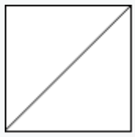

# 959. Regions Cut By Slashes

In a N x N `grid` composed of 1 x 1 squares, each 1 x 1 square consists of a `/`, `\`, or blank space. These characters divide the square into contiguous regions.

(Note that backslash characters are escaped, so a `\` is represented as `"\\"`.)

Return the number of regions.

**Example 1:**

```
Input:
[
  " /",
  "/ "
]
Output: 2
Explanation: The 2x2 grid is as follows:
```



**Example 2:**

```
Input:
[
  " /",
  "  "
]
Output: 1
Explanation: The 2x2 grid is as follows:
```


**Example 3:**

```
Input:
[
  "\\/",
  "/\\"
]
Output: 4
Explanation: (Recall that because \ characters are escaped, "\\/" refers to \/, and "/\\" refers to /\.)
The 2x2 grid is as follows:
```


**Example 4:**

```
Input:
[
  "/\\",
  "\\/"
]
Output: 5
Explanation: (Recall that because \ characters are escaped, "/\\" refers to /\, and "\\/" refers to \/.)
The 2x2 grid is as follows:
```


**Example 5:**

```
Input:
[
  "//",
  "/ "
]
Output: 3
Explanation: The 2x2 grid is as follows:
```

 


**Note:**

1. `1 <= grid.length == grid[0].length <= 30`
2. `grid[i][j]` is either `'/'`, `'\'`, or `' '`.

# Version

Use Union Find

可以将一个grid划分成4小块，并且标号


如果碰到`'/'`，我们就将`0`和`3`进行归并。如果碰到`'\\'`，我们就将`1`和`2`归并。如果碰到`' '`， 我们就将`1`、`2`、`3`和`4`全部归并。


对于相邻的格子，还需要合并左右相邻grid的1号和3号；上下相邻的2号和4号


```cpp
class Solution {
public:
    int count, n;
    vector<int> father;
    int regionsBySlashes(vector<string>& grid) {
        n = grid.size();
        count = n * n * 4;
        for(int i = 0; i < count; i++) {
            father.push_back(i);
        }
        
        for(int i = 0; i < n; i++) {
            for(int j = 0; j < n; j++) {
                if(i > 0) Union(getLoc(i - 1, j, 2), getLoc(i, j, 0));
                if(j > 0) Union(getLoc(i, j - 1, 1), getLoc(i, j, 3));
                if(grid[i][j] != '/') {
                    Union(getLoc(i, j, 0), getLoc(i, j, 1));
                    Union(getLoc(i, j, 2), getLoc(i, j, 3));
                }
                if(grid[i][j] != '\\') {
                    Union(getLoc(i, j, 1), getLoc(i, j, 2));
                    Union(getLoc(i, j, 0), getLoc(i, j, 3));
                }
                   
            }
        }
        return count;
    }
    
    int findFather(int x) {
        if(x == father[x]) return x;
        else {
            int F = findFather(father[x]);
            father[x] = F;
            return F;
        }
    }
    void Union(int a, int b) {
        int faA = findFather(a);
        int faB = findFather(b);
        if(faA != faB) {
            father[faA] = faB;
            count--;
        }
    }
    int getLoc(int x, int y, int k) {
        return (x * n + y) * 4 + k;
    }
};
```

