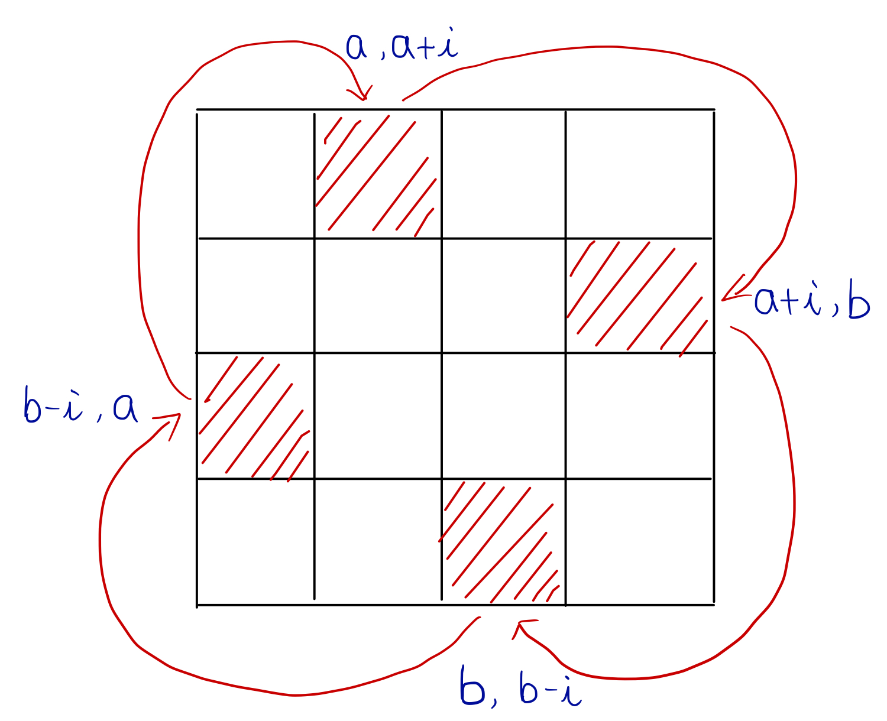

# 48. Rotate Image

You are given an *n* x *n* 2D `matrix` representing an image, rotate the image by 90 degrees (clockwise).

You have to rotate the image [**in-place**](https://en.wikipedia.org/wiki/In-place_algorithm), which means you have to modify the input 2D matrix directly. **DO NOT** allocate another 2D matrix and do the rotation.

 

**Example 1:**


```
Input: matrix = [[1,2,3],[4,5,6],[7,8,9]]
Output: [[7,4,1],[8,5,2],[9,6,3]]
```

**Example 2:**


```
Input: matrix = [[5,1,9,11],[2,4,8,10],[13,3,6,7],[15,14,12,16]]
Output: [[15,13,2,5],[14,3,4,1],[12,6,8,9],[16,7,10,11]]
```

**Example 3:**

```
Input: matrix = [[1]]
Output: [[1]]
```

**Example 4:**

```
Input: matrix = [[1,2],[3,4]]
Output: [[3,1],[4,2]]
```

 

**Constraints:**

- `matrix.length == n`
- `matrix[i].length == n`
- `1 <= n <= 20`
- `-1000 <= matrix[i][j] <= 1000`


## Brilliant Solution!!!

Assume a matrix $$A=\left[\begin{aligned}A_1\\A_2\\A_3\end{aligned}\right]$$

Rotate matrix A, we get $$A_R=[A_3^T\;A_2^T\;A_1^T]$$

We can achieve this aim by **reversing** $A_3$ and $A_1$ and **transpose** this matrix

reverse $A_3$ and $A_1$, we get $$A'=\left[\begin{aligned}A_3\\A_2\\A_1\end{aligned}\right]$$

$$A'^T=[A_3^T\;A_2^T\;A_1^T]=A_R$$


```cpp
class Solution {
public:
    void rotate(vector<vector<int>>& matrix) {
        reverse(matrix.begin(), matrix.end());
        
        int n = matrix.size();
        for(int i = 0; i < n; i++) {
            for(int j = i + 1; j < n; j++)
                swap(matrix[i][j], matrix[j][i]);
        }
    }
};
```


## Naive Solution



```cpp
class Solution {
public:
    void rotate(vector<vector<int>>& matrix) {
        int n = matrix.size();
        int a = 0, b = n - 1;
        
        while(a < b) {
            for(int i = 0; i < (b - a); i++) {
                swap(matrix[a][a + i], matrix[a + i][b]);
                swap(matrix[a][a + i], matrix[b][b - i]);
                swap(matrix[a][a + i], matrix[b - i][a]);
            }
            a++, b--;
        }
    }
};
```


我觉得通过transpose是更好的方案，但是他并不容易想到