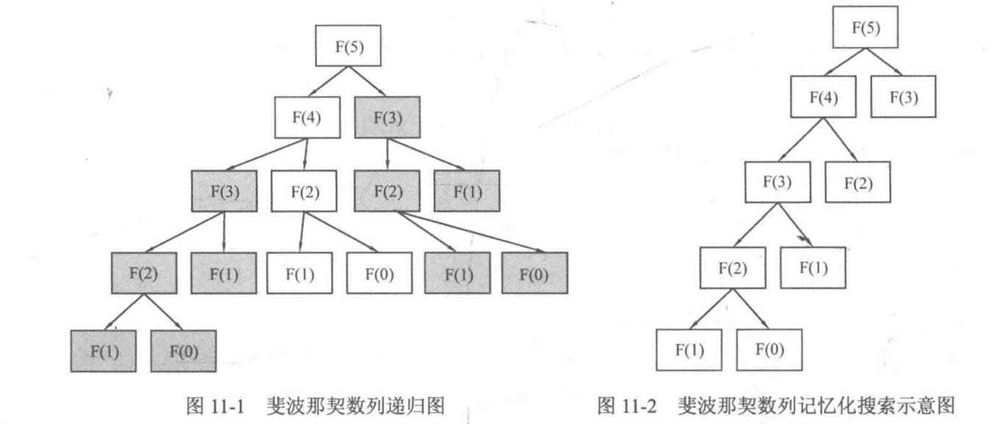
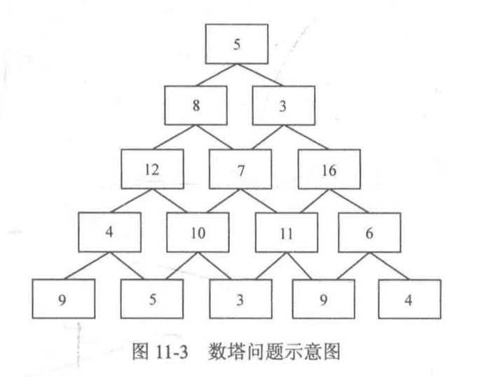
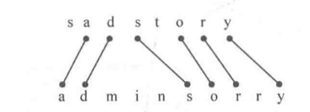

# 动态规划

# 1. dp的递归写法和递推写法

## 1.1 什么是动态规划

是一种用来解决一类最优化问题的算法思想。

dp将一个复杂的问题分解成若干个字问题，通过综合子问题的最优解来得到原问题的最优解。并且dp会将每个求解过的子问题的解记录下来，当下一次碰到同样的子问题时，就可以直接使用之前记录的结果，而不是重复计算。

## 1.2 dp的递归写法

考虑斐波那契数列问题

```cpp
int F(int n) {
  if(n == 0 || n == 1) return 1;
  else return F(n - 1) + F(n - 2);
}
```

这种递归方式会涉及很多重复的计算

为了避免重复计算，可以开一个一维数组dp, 用来保存已经计算过的结果。dp[n]记录F(n)的结果，dp[n]=-1表示F(n)当前还没有被计算过

```cpp
int F(int n) {
  if(n == 0 || n == 1) return 1;
  else if(d[n] != -1) return d[n];
  else {
    dp[n] = F(n - 1) + F(n - 2);
    return dp[n];
  }
}
```

通过这样的记忆化搜索，把复杂度从$O(2^n)$降到了$O(n)$



引出一个概念：

如果一个问题可以被分解为若干个子问题，且这些子问题会重复出现，那么就成为这个问题拥有重叠子问题(overlapping subproblems)。

动态规划通过记录重叠子问题的解，使得下次碰到相同的子问题时能直接使用之前记录的结果，以此避免大量的重复计算。

因此，一个问题必须拥有重叠子问题，才能用动态规划去解决。

<br>

## 1.3 dp的递推写法

考虑数塔问题。从第一层走道第n层，求经过路径的数字之和的最大值



如果穷举所有路径，复杂度是$O(2^n)$

为什么会有这么高的复杂度：

考虑从5出发，按5-8-7的路线来到7，并且枚举从7出发到底层的所有路径；之后我们又以5-3-7的路线来到7，又开始枚举从7出发到底层的所有路径。这是冗余的操作

因此，我们令dp\[i][j]表示从第i行第j个数字出发的到达最底层的所有路径中能得到的最大和。如dp\[3][2]就表示7到达底层的路径的最大和。我们要求的答案就是dp\[1][1]

第一步的选择:

dp\[1][1]=max(dp\[2][1],dp\[2][2])+f\[1][1]

推广到每一步

dp\[i][j]=max(dp\[i+1][j],dp\[i+1][j+1])+f\[i][j]

我们称这个式子为状态转移方程

注意到最底层数塔， dp\[n][j]=f\[n][j], dp可以从这些边界出发，通过状态方程扩散到整个dp数组

```cpp
#include<cstdio>
#include<iostream>
using namespace std;
const int maxn = 1000;
int f[maxn][maxn], dp[maxn][maxn];

int main() {
  int n;
  scanf("%d", &n);
  for(int i = 1; i <= n; i++) {
    for(int j = 1; j <= i; j++) {
      scanf("%d", &f[i][j]);
    }
  }
  //边界
  for(int j = 1; j <= n; j++)
    dp[n][j] = f[n][j];
  
  for(int i = n - 1; i >= 1; i--) {
    for(int j = 1; j <= i; j++) {
      dp[i][j] = max(dp[i + 1][j], dp[i + 1][j + 1]) + f[i][j];
    }
  }
  printf("%d\n", dp[1][1]);
}
```

* 递推写法是***自底向上***的，即从边界开始，不断向上解决问题

* 递归写法是自动向下的，即从目标问题开始，将它分解成子问题的组合，直到分解到边界为止。

<br>

从上面的例子可以引出一个概念：

如果一个问题的最优解可以由其子问题的最优解有效的构造出来，那么称这个问题拥有***最优子结构***。 

一个问题必须拥有***重叠子问题***和***最优子结构***，才能用动态规划去解决。

<br>

越辩越明，他们什么区别？

* 分治与动态规划。
  * 相同点是豆浆问题分解为子问题，然后合并子问题的解来得到原问题的解。
  * 区别
    * 分治法分解出的子问题是不重叠的(如归并排序和快速排序都是分别处理左序列和右序列，然后合并左右序列)； 并且分治法解决的不一定是最优化问题
    * 动态规划的问题拥有重叠子问题。动态规划解决的一定是最优化问题
* 贪心与动态规划。
  * 相同点是都要求原问题拥有最优子结构
  * 区别
    * 贪心的计算方式类似于自顶向下，但是并不等待子问题求解完毕后再选择使用哪一个，而是通过一种策略直接选择一个子问题去求解，没被选择的子问题就不去求解了，直接抛弃。 壮士断腕
    * 动态规划总是会考虑所有子问题，并选择最优的结果


# 2. 最大连续子序列和

给定一个数字序列A1,A2,..., An, 求i, j(1<=i<=j<=n), 使得Ai+...+Aj最大，输出这个最大和

思路1: 暴力。枚举所有的左右端点，复杂度为$O(n^2)$， 计算A[i]+...+A[j]需要$O(n)$的复杂度，所以总复杂度为$O(n^3)$

思路2： 动态规划

令dp[i]表示以A[i]作为末尾的连续序列的最大和

假设有个序列

```
     -2 11 -4 13 -5 -2
下标  0  1  2  3  4  5
```

则

```
dp[0]=-2
dp[1]=11
d[2]=11-4=7
dp[3]=11-3+13=20
dp[4]=20-5=15
dp[5]=15-2=13
```

这个问题的结果就是dp[0],dp[1],...,dp[n-1]中的最大值

那么问题就是如何求解dp数组

因为dp[i]必须以A[i]结尾，因此只有两种情况

* 只有一个元素A[i]
* 有多个元素,A[p]--A[i]

因此写出状态转移方程

dp[i]=max{A[i], dp[i - 1] + A[i]}

边界dp[0]=A[0]

```cpp
#include<cstdio>
#include<algorithm>
using namespace std;
const int maxn = 10010;
int A[maxn], dp[maxn];
int main() {
  int n;
  scanf("%d", &n);
  for(int i = 0; i < n; i++) {
    scanf("%d", &A[i]);
  }
  
  dp[0] = 0; //边界
  for(int i = 1; i < n; i++) {
    //状态转移方程
    dp[i] = max(A[i], dp[i - 1] + A[i]);
  }
  
  int k = 0;
  for(int i = 1; i < n; i++) {
    if(dp[i] > dp[k])
      k = i;
  }
  printf("%d\n", dp[k]);
}

```

状态无后效性： 当前状态记录了历史信息，一旦当前状态确定，就不会再改变，且未来的决策只能在已有的一个或者若干个状态的基础上进行，历史信息只能通过已有的状态去影响未来的状态。

对于dp, 必须设计拥有无后效性的状态和状态转移方程。


# 3. 最长不下降子序列(LIS)

在一个数字序列中，找到一个最长的子序列(可以不连续)，使得这个子序列是不下降(非递减)的。

例如: A={1,2,3,-1,-2,7,9}, 那么他的最长不下降子序列为{1,2,3,7,9}, 长度为5.

思路1:枚举。对于每个元素都有取和不取两种情况，然后判断序列是否为不下降序列。但是复杂度为$O(2^n)$

但是上述思路包含了大量的重复计算。

令dp[i]表示以A[i]结尾的最长不下降子序列长度，A[i]有两种可能性

* 如果存在A[i]之前的元素A[j] (j<i), 使得A[j]<=A[i]并且dp[j]+1>dp[i]。那么就把A[i]跟在以A[j]结尾的LIS后面，形成一条更长的不下降子序列(令dp[i]=dp[j]+1)
* 如果A[i]之前的元素都比A[i]大，则LIS只有A[i], 长度为1

写出状态转移方程

dp[i]=max{1, dp[j]+1} (j=1,2,..., i-1 && A[j] < A[i])

```cpp
#include<cstdio>
#include<algorithm>
using namespace std;
const int N = 100;
int A[N], dp[N];

int main() {
  int n;
  scanf("%d", &n);
  for(int i = 1; i <= n; i++) 
    scanf("%d", &A[i]);
  
  int ans = -1;
  for(int i = 1; i <= n; i++) {
    dp[i] = 1;
    for(int j = 1; j < i; j++) {
      if(A[j] <= A[i] && dp[j] + 1 > dp[i]) {
        dp[i] = dp[j] + 1;
      }
    }
    ans = max(ans, dp[i]);
  }
  printf("%d\n", ans);
}
```

# 4. 最长公共子序列

给定两个字符串(或数字序列)A和B，求一个字符串，使得这个字符串是A和B的最长公共部分(子序列可以不连续)



暴力：设字符串A和B的长度分别是n, m, 那么对两个字符串中的每个字符，分别有选和不选两个决策。得到两个子序列后，比较两个子序列是否相同需要O(max(m,n)), 这样总复杂度为$O(2^{m+n}max(m,n))$

dp的做法

令dp\[i][j]表示字符串A的i号位和字符串B的j号位之前的LCS长度。那么可以根据A[i]和B[j]的情况，作出两种决策

* A[i]==B[j], 则dp\[i][j]=dp\[i-1][j-1]+1
* A[i]!=B[j], 则dp\[i][j]=max(dp\[i-1][j], dp\[i][j-1])

边界位dp\[i][0]=dp\[0][j]=0

```cpp
#include<cstdio>
#include<cstring>
#include<algorithm>
using namespace std;
const int N = 100;
char A[N], B[N];
int dp[N][N];

int main() {
  int n;
  gets(A + 1);
  gets(B + 1);
  int lenA = strlen(A + 1);
  int lenB = strlen(B + 1);
  
  //边界
  for(int i = 0; i <= lenA; i++)
    dp[i][0] = 0;
  for(int j = 0; j <= lenB; j++) 
    dp[0][j] = 0;
  
  for(int i = 1; i <= lenA; i++) {
    for(int j = 1; j <= lenB; j++) {
      if(A[i] == B[j])
        dp[i][j] = dp[i - 1][j - 1] + 1;
      else 
        dp[i][j] = max(dp[i - 1][j], dp[i][j - 1]);
    }
	}
  printf("%d\n", dp[lenA][lenB]);
}
```


