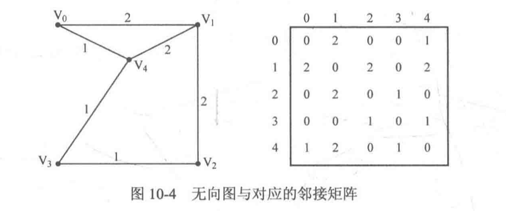
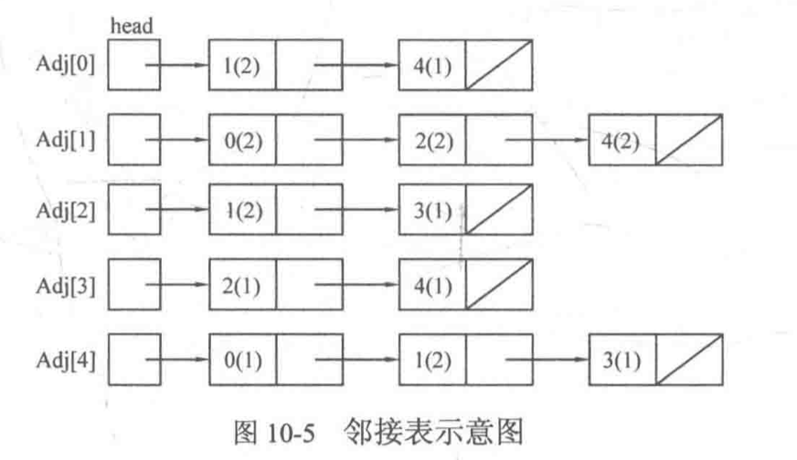

# 图算法专题

# 1. 图的存储

### A. 邻接矩阵



设图G(V,E)的顶点标号为0,1,...,N-1, 那么可以令二维数组G\[N][N]的两维分别表示图的顶点标号。

* G\[i][j]=1, 说明顶点i和顶点j之间有边
* G\[i][j]=0, 说明顶点i和顶点j之间不存在边

这个二维数组G\[][]被称为邻接矩阵。如果存在边权，可以令G\[i][j]存放边权，对不存在的边可以设边权为0，-1或者是一个很大的数。

注意：

虽然邻接矩阵比较好写，但是由于需要开一个二维数组，如果顶点数目太大，便可能会超过题目限制的内存。因此邻接矩阵只适用于顶点数目不太大(一般不超过1000)的题目


### B. 邻接表

设图G(V,E)的顶点编号为0,1,...,N-1, 每个顶点都可能有若干条出边，如果吧同一个顶点的所有出边放在一个列表中，那么N个顶点就会有N个列表（没有出边，则对应空表）。这N个列表被称为图G的邻接表，记为Adj[N], 其中Adj[i]存放顶点i的所有出边组成的列表，这样Adj[0], Adj[1], ..., Adj[N-1]就分别都是一个列表。

可以通过链表来实现



可以用vector来实现

如果邻接表只存放每条边的终点编号，而不存放边权，则vector中的元素类型可以直接定义为int型：

```cpp
vector<int> Adj[N];
```

如果想添加一条从1号顶点到达3号顶点的有向边，只需要在Ajd[1]中添加终点编号3即可。。

```cpp
Adj[1].push_back(3);
```

<br>

如果需要同时存放终点编号和边权，可以建立结构体Node, 用来存放每条边的终点编号和边权

```cpp
struct Node {
  int v;	//边的终点编号
  int w;	//边权
};
```

这样vector邻接表中的元素类型就是Node型的

```cpp
vector<Node> Adj[N];
```

如果想要添加从1号到达3号顶点的有向边，边权为4，就可以定义一个Node型的临时变量temp

```cpp
Node temp;
temp.v = 3;
temp.w = 4;
Adj[1].push_back(tmp);
```

当然，更快的做法是定义结构体Node的构造函数

```cpp
struct Node {
  int v, w;
  Node(int _v, int _w): v(_v), w(_w) {}
}
```

这样就能不定义临时变量来实现加边操作

```cpp
Adj[1].push_back(Node(3, 4));
```


# 2. 图的遍历

### A. DFS遍历图

DFS的具体实现：

* 连通分量

在无向图中，如果两个顶点之间可以互相到达，那么就称这两个顶点连通。如果图G(V,E)的任意两个顶点都连通，则称图G为连通图；否则，称图G为非连通图，且称其中的极大连通子图为连通分量。

* 强连通分量

在有向图中，如果两个顶点可以各自通过一条有向路径到达另一个顶点，就称这两个顶点强连通。如果图G(V,E)的任意两个顶点都强连通，则称图G为强连通图；否则， 称图G为非强连通图，且称其中的极大强连通子图为强连通分量。


如果想要遍历整个图，就需要对所有连通快分别进行遍历。所以DFS遍历图的基本思路就是将经过的顶点设置为已访问，在下次递归碰到这个顶点时就不再去处理，直到整个图的顶点都被标记为已访问。

伪代码版本

```cpp
DFS(u) {//访问顶点u
  vis[u] = true;	//顶点u已被访问
  for(从u出发能到达的所有顶点v)	//枚举从u出发可以到达的所有顶点v
    if(vis[v] == false)//如果v没有被访问过
      DFS(v);	//递归访问v
}
DFSTrave(G) {	//遍历图G
  for(G的所有顶点u)
    if(vis[u] == false)
      DFS[u];
}
```

<br>

```cpp
const int MAXV = 1000; //最大顶点数
const int INF = 10000000; //设INF为一个很大的数
```

邻接矩阵版

```cpp
int n, G[MAXV][MAXV];
bool vis[MAXV] = {false};

void DFS(int u, int depth) {
  vis[u] = true;
  for(int v = 0; v < n; v++) {
    if(vis[v] == false && G[u][v] != INF) {
      DFS(v, depth + 1);
    }
  }
}

void DFSTrave() {
  for(int u = 0; u < n; u++) {
    if(vis[u] == false) {
      DFS(u, 1);
    }
  }
}
```


邻接表版

```cpp
vector<int> Adj[MAXV];
int n;
bool vis[MAXV] = {false};

void DFS(int u, int depth) {
  vis[u] = true;
  for(int i = 0; i < Adj[u].size(); i++) {
    DFS(v, depth + 1);
  }
}

void DFSTrave() {
  for(int u = 0; u < n; u++) {
    if(vis[u] == false) {
      DFS(u, 1);
    }
  }
}
```

Example

1034 Head of a Gang (30分)

One way that the police finds the head of a gang is to check people's phone calls. If there is a phone call between *A* and *B*, we say that *A* and *B* is related. The weight of a relation is defined to be the total time length of all the phone calls made between the two persons. A "Gang" is a cluster of more than 2 persons who are related to each other with total relation weight being greater than a given threshold *K*. In each gang, the one with maximum total weight is the head. Now given a list of phone calls, you are supposed to find the gangs and the heads.

Input Specification:

Each input file contains one test case. For each case, the first line contains two positive numbers *N*and *K* (both less than or equal to 1000), the number of phone calls and the weight threthold, respectively. Then *N* lines follow, each in the following format:

```
Name1 Name2 Time
```

where `Name1` and `Name2` are the names of people at the two ends of the call, and `Time` is the length of the call. A name is a string of three capital letters chosen from `A`-`Z`. A time length is a positive integer which is no more than 1000 minutes.

Output Specification:

For each test case, first print in a line the total number of gangs. Then for each gang, print in a line the name of the head and the total number of the members. It is guaranteed that the head is unique for each gang. The output must be sorted according to the alphabetical order of the names of the heads.

Sample Input 1:

```in
8 59
AAA BBB 10
BBB AAA 20
AAA CCC 40
DDD EEE 5
EEE DDD 70
FFF GGG 30
GGG HHH 20
HHH FFF 10
```

Sample Output 1:

```out
2
AAA 3
GGG 3
```

Sample Input 2:

```in
8 70
AAA BBB 10
BBB AAA 20
AAA CCC 40
DDD EEE 5
EEE DDD 70
FFF GGG 30
GGG HHH 20
HHH FFF 10
```

Sample Output 2:

```out
0
```

```cpp
#include<iostream>
#include<string>
#include<map>
using namespace std;

const int maxn = 2010;
const int INF = 10000000;

map<int, string> intToString;
map<string, int> stringToInt;
map<string, int> Gang;

int G[maxn][maxn] = {0};
int weight[maxn] = {0};
int n, k, numPerson = 0;
bool vis[maxn] = {false};


void DFS(int nowVisit, int& head, int& numMember, int& totValue) {
    numMember++;
    vis[nowVisit] = true;
    if(weight[nowVisit] > weight[head]) {
        head = nowVisit;
    }
    for(int i = 0; i < numPerson; i++) {
        if(G[nowVisit][i] > 0) {
            totValue += G[nowVisit][i];
            G[nowVisit][i] = G[i][nowVisit] = 0;
            if(vis[i] == false) {
                DFS(i, head, numMember, totValue);
            }
        }
    }
}
void DFSTrave() {
    for(int i = 0; i < numPerson; i++) {
        if(vis[i] == false) {
            int head = i, numMember = 0, totValue = 0;
            DFS(i, head, numMember, totValue);
            if(numMember > 2 && totValue > k) {
                Gang[intToString[head]] = numMember;
            }
        }
    }
}

int change(string str) {
    if(stringToInt.find(str) != stringToInt.end()) {
        return stringToInt[str];
    } else {
        stringToInt[str] = numPerson;
        intToString[numPerson] = str;
        return numPerson++;
    }
}

int main() {
    int w;
    string str1, str2;
    cin >> n >> k;

    for(int i = 0; i < n; i++) {
        cin >> str1 >> str2 >> w;
        int id1 = change(str1);
        int id2 = change(str2);
        weight[id1] += w;
        weight[id2] += w;
        G[id1][id2] += w;
        G[id2][id1] += w;
    }

    DFSTrave();
    cout << Gang.size() << endl;
    map<string, int>::iterator it;
    for(it = Gang.begin(); it != Gang.end(); it++) {
        cout << it->first << " " << it->second << endl;
    }
    return 0;
}
```


### B.BFS遍历图

使用BFS遍历图的基本思想是建立一个队列，并把初始顶点加入队列，此后每次都取出队首顶点进行访问，并把从该顶点出发可以到达的未曾加入过队列(而不是而访问)的顶点全部加入队列，直到队列为空。

```cpp
BFS(u) {
  queue q; //定义队列q
  将u入队;
  inq[u] = true; //设置u已被加入过队列
  while(q非空) {
    取出q的队首元素u进行访问;
    for(从u出发可达的所有顶点v) {
      if(inq[v] == false) {
        将v入队;
        inq[v] = true;	//设置v已被加入过队列
      }
    }
  }
}
```

#### 邻接矩阵实现

```cpp
int n, G[MAXV][MAXV];//n为顶点树
bool inq[MAXV] = {false};//若顶点i曾入过队列，则inq[i]=true

void BFS(int u) { //遍历u所在的连通块
  queue<int> q;
  q.push(u);
  inq[u] = true;
  while(!q.empty()) {
    int u = q.front();
    q.pop();
    for(int v = 0; v < n; v++) {
      if(inq[v] == false && G[u][v] != INF) {
        q.push(v);
        inq[v] = true;
      }
    }
  }
}
void BFSTrave() {
  for(int u = 0; u < n; u++) {
    if(inq[u] == false) {
      BFS(u);
    }
  }
}
```

#### 邻接表实现

```cpp
vector<int> Adj[MAXV];
int n;
bool inq[MAXV] = {false};

void BFS(int u) {
  queue<int> q;
  q.push(u);
  inq[u] = true;
  while(!q.empty()) {
    int u = q.front();
    q.pop();
    for(int i = 0; i < Adj[u].size(); i++) {
      int v = Adj[u][i];
      if(inq[v] == false) {
        q.push(v);
        inq[v] = true;
      }
    }
  }
}

void BFSTrave() {
  for(int u = 0; u < n; u++) {
    if(inq[u] == false) {
      BFS(q);
		}
  }
}
```

<br>

```cpp
struct Node {
  int v;
  int layer;
};
```

```cpp
vector<Node> Adj[N];
```

```cpp
void BFS(int s) {
  queue<Node> q;
  Node start;
  start.v = s;
  start.layer = 0;
  q.push(start);
  inq[start.v] = true;
  while(!q.empty()) {
    Node topNode = q.front();
    q.pop();
    int u = topNode.v;
    for(int i = 0; i < Adj[u].size(); i++) {
      Node next = Adj[u][i];
      next.layer = topNode.layer + 1;
      if(inq[next.v] == false) {
        q.push(next);
        inq[next.v] = true;
      }
    }
  }
}
```


<br>

# 3. 最短路径

### A. Dijkstra算法

Dijkstra算法用来解决单源最短路径问题, 即给定图G(V,E)和起点s, 求从起点s到达其他顶点的最短距离

设置集合S存放已被访问的顶点，然后执行n次下面的两个步骤(n为顶点个数)

1. 每次从集合V-S(即没有被访问过的顶点)中选择与起点s的最短距离最小的一个顶点u, 访问并加入集合S
2. 令顶点u为中介点，优化起点s与从u能到达的顶点v之间的最短距离

在具体实现时

1. 集合S可以用一个bool数组vis[]来实现，当vis[i]==true时表示顶点$V_i$已经被访问，当vis[i]==false时表示顶点$V_i$未被访问
2. 令int数组d[]表示起点s到达顶点$V_i$的最短距离，初始时除了起点s的d[s]赋为0，其余顶点都初始化为一个很大的数,可以使用$10^9$, 也可以用0x3fffffff, 但是不要用0x7ffffffff, 因为这样两个数相加会超过int的表示范围

伪代码

```cpp
Dijkstra(G, d[], s) {
  初始化;
  for(循环n次) {
    u = 使d[u]最小的还未被访问的顶点的编号;
    记u已被访问;
    for(从u出发能到达的所有顶点v) {
      if(v未被访问&&以u为中介使s到顶点v的最短距离d[v]更优) {
        优化d[v];
      }
    }
  }
}
```

<br>

```cpp
const int MAXV = 1000;
const int INF = 10000000;
```

#### 邻接矩阵实现

```cpp
int n, G[MAXV][MAXV];
int d[MAXV];
bool vis[MAXV] = {false};

void Dijkstra(int s) {
  fill(d, d + MAXV, INF); //fill函数将整个d数组初始化为INF
  d[s] = 0;
  for(int i = 0; i < n; i++) {
    int u = -1, MIN = INF;
    //从未访问的顶点中选择一个到s的距离最小的顶点u
    for(int j = 0; j < n; j++) {
      if(vis[j] == false && d[j] < MIN) {
        u = j;
        MIN = d[j];
      }
    }
    if(u == -1) return;
    vis[u] = true;
    //更新从u能到达的顶点的最短距离
    for(int v = 0; v < n; v++) {
      if(vis[v] == false && G[u][v] != INF && d[u] + G[u][v] < d[v])
        d[v] = d[u] + G[u][v];
    }
  }
}
```

#### 邻接表实现

```cpp
struct Node {
  int v;
  int dis;
};
vector<Node> Adj[MAXN];
int n;
int d[MAXV];
bool vis[MAXV] = {false};

void Dijkstra(int s) {
  fill(d, d + MAXV, INF);
  d[s] = 0;
  for(int i = 0; i < n; i++) {
    int u = -1; MIN = INF;
    for(int j = 0; j < Adj[i].size(); j++) {
      if(vis[j] == false && d[j] < MIN) {
        u = j;
        MIN = d[j];
      }
    }
    if(u == -1) return;
    vis[u] = true;
    
    for(int j = 0; j < Adj[u].size(); j++) {
      int nodeID = Adj[u][j].v;
      if(vis[nodeID] == false && d[u] + Adj[u][j].dis < d[nodeID]) {
        d[nodeID] = d[u] + Adj[u][j].dis;
      }
    }
  }
}
```

复杂度分析:

主要是外层循环$O(V)$与内层循环(寻找最小的d[u]需要$O(V)$, 枚举v需要$O(adj[u].size())$)。对于整个程序来说，枚举v的次数总共为$O(\sum_{u=0}^{n-1}adj[u].size)=O(E)$, 因此总复杂度为$O(V^2+E)$

寻找最小d[u]的过程可以优化，使用最小堆，复杂度可以降为$O(VlogV+E)$

Dijkstra算法只能应对所有边权都是非负数的情况，如果边权出现负数，Dijkstra算法可能会出错，最好使用SPFA算法

<br>

#### 求解最短路径的写法

在Dijkstra算法中有一段

```cpp
if(v未被访问 && 以u为中介点可以使起点s到顶点v的最短距离d[v]更优) {
  优化d[v];
}
```

我们设置一个数组pre[], pre[v]记录从起点s到顶点v的最短路径上v的前一个顶点(前驱节点)

```cpp
if(v未被访问 && 以u为中介点可以使起点s到顶点v的最短距离d[v]更优) {
  优化d[v];
  令v的前驱为u;
}
```

<br>

```cpp
int n, G[MAXV][MAXV];
int d[MAXV];
int pre[MAXV];
bool vis[MAXV] = {false};

void Dijkstra(int s) {
  fill(d, d + MAXV, INF);
  for(int i = 0; i < n; i++) pre[i] = i;
  d[s] = 0;
  for(int i = 0; i < n; i++) {
    int u = -1; int MIN = INF;
    for(int j = 0; j < n; j++) {
      if(vis[j] == false && d[j] < MIN) {
        u = j;
        MIN = d[j];
      }
    }
    
    if(u == -1) return;
    vis[u] = true;
    
    for(int v = 0; v < n; v++) {
      if(vis[v] == false && G[u][v] != INF && d[u] + G[u][v] < d[v]) {
        d[v] = d[u] + G[u][v];
        path[v] = u;
      }
    }
  }
}
```

<br>

如果要得到整一条路径

```cpp
void DFS(int s, int v) {
  if(v == s) {
    printf("%d\n", s);
    return;
  }
  DFS(s, pre[v]);
  printf("%d\n", v);
}
```

<br>

#### 存在第二标尺的情况

当然，有时候最短距离最小的路径不止一条。碰到这种有两条以上可以达到最短距离的路径，题目会给出第二个标尺(第一标尺是距离)，要求在所在所有最短路径中选择第二标尺最优的一条路径。第二标尺常见的是以下三种出题方法或其组合：

1. 给每条边再增加一个边权(比如花费)，然后要求在最短路径有多条时要求路径上的花费之和最小
2. 给每个点增加一个点权(比如每个城市能收集到的物资)，然后在最短路径有多条时要求路径上的点权之和最大
3. 直接问有多少条最短路径

针对第一种新增边权。以新增的边权代表花费为例，用cost\[u][v]表示u-->v的花费(题目给出)， 并增加一个数组c[], 令从起点到达顶点u的最少花费为c[u], 初始化时只有c[s]为0， 其余c[u]均为INF, 这样就可以在d[u]+G\[u][v]<d[v]时更新d[v]和c[v], 而当d[u]+G\[u][v]=d[v]且c[u]+cost\[u][v]<c[v]时更新c[v]

```cpp
for(int v = 0; v < n; v++) {
  if(vis[v] == false && G[u][v] != INF) {
    if(d[u] + G[u][v] < d[v]) {
      d[v] = d[u] + G[u][v];
      c[v] = c[u] + cost[u][v];
		} else if(d[u] + G[u][v] == d[v] && c[u] + cost[u][v] < c[v]) {
      c[v] = c[u] + cost[u][v];
    }
  }
}
```

针对第二种情况新增点权。以新增的点权代表城市中能收集到的物资为例，用weight[u]表示盛水u中的物资数目(由题目输入)，并增加一个数组w[], 令从起点到达顶点u可以收集到的最大物资为w[u], 初始化时只有w[s]为weight[s], 其余w[u]均为0。 这样就可以在d[u]+G\[u][v]<d[v]时更新d[v]和w[v]。 而当d[u]+G\[u][v]==d[v]且w[u]+weight[v] > w[v]时更新w[v]

```cpp
for(int v = 0; v < n; v++) {
  if(vis[v] == false && G[u][v] != INF) {
    if(d[u] + G[u][v] < d[v]) {
      d[v] = d[u] + G[u][v];
      w[v] = w[u] + weight[v];
    } else if(d[u] + G[u][v] == d[v] && w[u] + weight[v] > w[v]) {
      w[v] = w[u] + weight[v];
    }
  }
}
```

针对求解最短路径条数，只需新增一个数组num[], 令从起点s到达顶点u的最短路径条数为num[u], 初始化时只有num[s]为1，其余num[u]均为0，这样就可以在d[u]+G\[u][v]<d[v]时更新d[v], 并且让num[v]继承num[u]; 当d[u]+G\[u][v]==d[v]时将num[u]加到num[v]上

```cpp
for(int v = 0; v < n; v++) {
  if(vis[v] == false && G[u][v] != INF) {
    if(d[u] + G[u][v] < d[v]) {
      d[v] = d[u] + G[u][v];
      num[v] = num[u];
    } else if(d[i] + G[u][v] == d[v]) {
      num[v] += num[u];
    }
  }
}
```

### B. Bellman-Ford算法和SPFA算法

Dijkstra不能解决存在负权边的最短路径问题，因此提出Bellman-Ford算法

Bellman-Ford问题可以解决单源最短路径问题，也能处理有负权边的情况。

考虑graph中的环。根据环中边的边权之和的正负，可以将环分为零环，正环，负环。


正环和零环不会影响最短路径的求解。如果存在负环，那么将在负环无限循环；但是如果负环无法从源点出发到达，那么最短路径的求解也不会受到影响。

<br>

Bellman-Ford算法设置一个数组d, 用来存放从源点到达各个顶点的最短距离。同时Bellman-Ford算法返回一个bool值: 如果其中存在从源点可达的负环，那么函数将返回false

<br>

对graph中对边进行V-1轮操作，每轮都遍历图中的所有边: 对每条边u->v, 如果以u为中介点可以使d[v]更小，即d[u]+length[u->v] < d[v], 就用d[u]+length[u->v]更新d[v]。

```cpp
for(i = 0; i < n - 1; i++) {
  for(each edge u->v) {
    if(d[u] + length[u->v] < d[v]) {
      d[v] = d[u] + length[u->v];
    }
  }
}
```

此时，如果图中没有从源点可达的负环，那么数组d中的所有值都应当已经达到最优。

只需要再对所有边进行一轮操作，判断是否有某条边u->v仍然满足d[u]+length[u->v] < d[v], 如果有，则说明图中有从源点可达的负环，返回false

```cpp
for(each edge u->v) {
  if(d[u] + length[u->v] < d[v]) {
    return false;
  }
}
return true;
```

<a href="https://blog.csdn.net/yuewenyao/article/details/81026278">算法原理</a>

由于Bellman-Ford算法需要遍历所有边，所以如果使用邻接矩阵的话，复杂度会很高，是$O(n^3)$

```cpp
struct Node {
  int v, dis;	//v为邻接边的目标顶点, dis为邻接边的边权
};
vector<Node> Adj[MAXV];	//图G的邻接表
int n;									//n为顶点数
int d[MAXV];						//起点到达各点的最短路径长度

bool Bellman(int s) {		//s为源点
  fill(d, d + MAXV, INF);
  d[s] = 0;
  //求解数组d的部分
  for(int i = 0; i < n - 1; i++) {	//执行n-1轮操作,n为顶点数
    for(int u = 0; u < n; u++) {		//每轮操作都遍历所有边
      for(int j = 0; j < Adj[u].size(); j++) {
        int v = Adj[u][j].v;			//邻接边的顶点
        int dis = Adj[u][j].dis;	//邻接边的边权
        if(d[u] + dis < d[v]) {		//以u为中介点可以使d[v]更小
          d[v] = d[u] + dis;			//松弛操作
        }
			}
    }
  }
  //以下为判断负环的代码
  for(int u = 0; u < n; u++) {
    for(int j = 0; j < Adj[u].size(); j++) {
        int v = Adj[u][j].v;
        int dis = Adj[u][j].dis;
        if(d[u] + dis < d[v]) {
         	return false;
        }
    }
  }
  return true;
}
```

多重标尺的做法与Dijkstra算法差不多，但是统计最短路径条数的做法有点不同。

Bellman-Ford算法期间会多次访问曾经访问过的顶点，如果单纯按照Dijkstra算法中介绍的num数组的写法，将会反复累计已经计算过的顶点，如果单纯按照Dijkstra算法中介绍的num数组的写法，将会反复累计已经计算过的顶点。为了解决这个问题，需要设置记录前驱的数组set<int> pre[MAXV], 当遇到一条河已有最短路径长度相同的路径时，必须重新计算最短路径条数。

```cpp
void Bellman(int s) {
  fill(d, d + MAXV, INF);
  memset(num, 0, sizeof(num));
  memset(w, 0, sizeof(w));
  d[s] = 0;
  w[s] = weight[s];
  num[s] = 1;
  
  for(int i = 0; i < n - 1; i++) {
    for(int u = 0; u < n; u++) {
      for(int j = 0; j < Adj[u].size(); j++) {
        int v = Adj[u][j].v;
        int dis = Adj[u][j].dis;
        if(d[u] + dis < d[v]) {
          d[v] = d[u] + dis;
          w[v] = w[u] + weight[v];
          num[v] = num[u];
          pre[v].clear();
          pre[v].insert(u);
        } else if(d[u] + dis == d[v]) {
          if(w[u] + weight[v] > w[v]) {
            w[v] = w[u] + weight[v];
          }
          pre[v].insert(u);
          num[v] = 0;
          set<int>::iterator it;
          for(it = pre[v].begin(); it != pre[v].end(); it++) {
            num[v] += num[*it];
          }
        }
      }
    }
  }
}
```

虽然Bellman-Ford算法思路简单，但是复杂度高。

Bellman-Ford算法的每轮操作需要操作所有边，显然这里会有大量无意义的操作。注意到，只有当某个顶点u的d[u]值改变时，从它出发的边的邻接点v的d[v]值才有可能改变。因此可以进行一个优化: 建立一个队列，每次将队首顶点u取出，然后对从u出发的所有边u->v进行松弛操作。

```cpp
queue<int> Q;
源点s入队;
while(队列非空) {
  取出队首元素u;
  for(u的所有邻接边u->v) {
    if(d[u] + dis < d[v]) {
      d[v] = d[u] + dis;
      if(v当前不在队列) {
        v入队;
        if(v入队次数大于n-1) {
          说明有负环, return;
        }
      }
    }
  }
}
```

这种优化后的算法被称为SPFA(Shortest path faster algorithm), 他的期望时间复杂度时$O(kE)$

```cpp
vector<Node> Adj[MAXV];
int n, d[MAXV], num[MAXV];//num记录顶点的入队次数
bool inq[MAXV];

bool SPFA(int s) {
  memset(inq, false, sizeof(inq));
  memset(num, 0, sizeof(num));
  fill(d, d + MAXV, INF);
  
  queue<int> Q;
  Q.push(s);
  inq[s] = true;
  num[s]++;
  d[s] = 0;
  
  while(!Q.empty()) {
    int u = Q.front(); Q.pop();
    inq[u] = false;
    
    for(int j = 0; j < Adj[u].size(); j++) {
      int v = Adj[u][j].v;
      int dis = Adj[u][j].dis;
      
      if(d[u] + dis < d[v]) {
        d[v] = d[u] + dis;
        if(!inq[v]) {
          Q.push(v);
          inq[v] = true;
          num[v]++;
          if(num[v] >= n) return false;
        }
      }
    }
  }
  return true;
}
```

<br>

### C. Floyd算法

解决全源最短路径问题，即对给定的图G(V,E), 求任意两点u,v之间的最短路径长度，复杂度为$O(n^3)$。 由于$n^3$的复杂度决定了顶点数n的限制约在200以内，因此可以使用邻接矩阵实现

Floyd算法基于这样一个事实：如果存在顶点k, 使得以k作为中介点时顶点i和顶点j的当前最短距离缩短，则使用顶点k作为顶点i和顶点j的中介点。即当`dis[i][k] + dis[k][j] < dis[i][j]`时，令`dis[i][j]=dis[i][k] + dis[k][j]`

```cpp
枚举顶点k属于[1,n]
  	以顶点k作为中介点，枚举所有顶点对i和j (i属于[1,n], j属于[1,n])
  		如果dis[i][k] + dis[k][j] < dis[i][j]成立
  			赋值dis[i][j] = dis[i][k] + dis[k][j];
```

<br>

```cpp
#include<cstdio>
#include<algorithm>
using namespace std;

const int INF = 0x3fffffff;
const int MAXV = 200;
int n, m;	//n为顶点数，m为边数
int dis[MAXV][MAXV];	//dis[i][j]表示顶点i和顶点j的最短距离

void Floyd() {
  for(int k = 0; k < n; k++) {
    for(int i = 0; i < n; i++) {
      for(int j = 0; j < n; j++) {
        if(dis[i][k] != INF && dis[k][j] != INF && dis[i][k] + dis[k][j] < dis[i][j]) {
          dis[i][j] = dis[i][k] + dis[k][j];
        }
      }
    }
  }
}
```

# 4. 最小生成树

最小生成树的3个性质

1. 最小生成树是树，边数=顶点数-1， 且树内一定不会有环
2. 对给定的图G(V,E), 其最小生成树可以不唯一，但是其边权之和一定是唯一的
3. 由于最小生成树是无法在无向图上生成的，因此其根节点可以是这棵树上的任意一个节点

<br>

### A.  prim算法

基本思想是对图G(V,E)设置集合S,存放已被访问的顶点，然后每次从集合V-S中选择与集合S的最短距离最小的一个顶点(记为u), 访问并加入集合S。之后，以顶点u为中介点，优化所有从u能到达的顶点v与集合S之间的最短距离，这样的操作执行n次(n为顶点个数)，直到集合S已包含所有顶点。

```cpp
//G为图，数组d为顶点与集合S的最短距离
Prim(G, d[]) {
	初始化;
  for(循环n次) {
    u = 使d[u]最小的还未被访问的顶点的标号;
    记u已被访问;
    for(从u出发能到达的所有顶点v) {
      if(v未被访问&&以u为中介点使得v与集合S的最短距离d[v]更优) {
        将G[u][v]赋值给v与集合S的最短距离d[v];
      }
    }
  }
}
```

```cpp
const int MAXV = 1000;
const int INF = 0x3fffffff;
```

#### 邻接矩阵实现

```cpp
int n, G[MAXV][MAXV];
int d[MAXV];	//顶点与集合s的最短距离
bool vis[MAXV] = {false};

int prim() {
  fill(d, d + MAXV, INF);
  d[0]  = 0;
  int ans = 0;	//存放最小生成树的边权之和
  
  for(int i = 0; i < n; i++) {
    int u = -1, MIN = INF;
    for(int j = 0; j < n; j++) {
      if(vis[j] == false && d[j] < MIN) {
        u = j;
        MIN = d[j];
      }
    }
    if(u == -1) return 01;
    vis[u] = true;
    ans += d[v];
    
    for(int v = 0; v < n; v++) {
      if(vis[v] == false && G[u][v] != INF && G[u][v] < d[v]) {
        d[v] = G[u][v];
      }
    }
  }
  return ans;
}
```


#### 邻接表实现

```cpp
struct Node {
  int v, dis;
};
vector<Node> Adj[MAXV];
int n;
int d[MAXV];
bool vis[MAXV] = {false};

int prim() {
  fill(d, d + MAXV, INF);
  dis[0] = 0;
  int ans = 0;
  for(int i = 0; i < n; i++) {
    int u = -1, MIN = INF;
    for(int j = 0; j < n; j++) {
      if(vis[j] == false && dis[j] < MIN) {
        u = j;
        MIN = dis[j];
      }
    }
    if(u == -1) return -1;
    vis[u] = true;
    ans += d[u];
    
    for(int j = 0; j < Adj[u].size(); j++) {
      int v = Adj[u][j].v;
      if(vis[v] == false &&  Adj[u][j].dis < d[v]) {
        d[v] = Adj[u][j].dis;
      }
    }
  }
}
```

### B. Kruskal 算法

1. 对所有边按边权从小到大排序
2. 按边权从小到大测试所有边，如果当前测试边所连接的两个顶点不在同一个连通块中，则把这条测试边加入最小生成树，否则舍弃
3. 不断执行步骤2，直到最小生成树中的边数=总顶点数-1或者测试完所有边时结束。而当结束时最小生成树的边数<总顶点数-1, 说明该图不连通

```cpp
int kruskal() {
  令最小生成树的边权之和为ans, 最小生成树的当前边数Num_Edge;
  将所有边按边权从小到大排序;
  for(从小到大枚举所有边) {
    if(当前测试边的两个端点在不同的连通块中) {
      将该测试边加入最小生成树中;
      ans += 测试边的边权;
      最小生成树的当前边数Num_Edge加1;
      当边数Num_Edge等于顶点数减1时结束循环;
    }
  }
  return ans;
}
```

这个伪代码还存在两个不太直观的实现细节：

* 如何判断测试边的两个端点是否在不同的连通块中
* 如何将测试边加入最小生成树中

如果把每个连通块当作一个集合，那么就可以把问题转换为判断两个端点是否在同一个集合中———并查集

```cpp
int father[N];
int findFather(int x) {
  
}

int kruskal(int n, int m) {
  int ans = 0, Num_Edge = 0;
  for(int i = 1; i <= n; i++) {
    father[i] = i;
  }
  sort(E, E + m, cmp);
  for(int i = 0; i < m; i++) {
    int faU = findFather(E[i].u);
    int faV = findFather(E[i].v);
    if(faU != faV) {
      father[faU] = faV;
      ans += E[i].cost;
      Num_Edge++;
      if(Num_Edge == n-1) break;
    }
  }
  if(Num_Edge != n - 1) return -1;
  else return ans;
}
```

kruskal算法的时间复杂度主要来自对边排序。

如果是稠密图，用prim算法

如果是稀疏图，用kruskal算法

