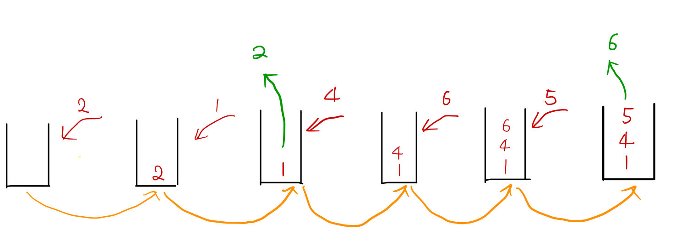

# Monotone Stack

## 1. 什么是单调栈

栈内元素大小顺序是单调的。和stack一样，monotone stack也只能在栈顶操作。

来看一下元素加入单调栈的过程

> 我们去海底捞排队，每个人都有一个号，号越小越早叫到。
>
> 我们取了号之后去喝喜茶里，会来后发现队伍已经很长了。我们不能直接插入队伍，而是跑到队伍最后，挨个询问排队的人的号是多少。我们认为比我们大的号都是插队的，我们将这些人弹出栈，直到有人的号比我们的小，我们加入栈。

有一个数组[2, 1, 4, 6, 5]，我们要把它的元素逐个加入单调栈，效果如下

## 2. 单调栈的优势

### 2.1 使用单调递增栈可以找到元素向左遍历第一个比他小的元素

如上图所示，一开始2入栈，然后1入栈，发现2比自己大，这时候2就会出栈。1左边没有元素了，说明没有元素比1小。

4入栈，左边第一个是1，所以数组左边有比4小的元素1

6入栈，左边第一个是4，所以在数组中6左边第一个比他小的元素是4

### 2.2 使用单调递增栈可以找到元素向左遍历第一个比他大的元素。

比该数大的元素会一个一个出栈，出栈顺序是从该元素在数组中位置向左遍历。

如上图所示，1入栈，2会出栈，所以2比1大。

5入栈，则6出栈，说明数组中5的左边还有6比5大

## 3 实战

Reference:  

[1] https://blog.csdn.net/liujian20150808/article/details/50752861

[2]https://www.cnblogs.com/grandyang/p/8887985.html