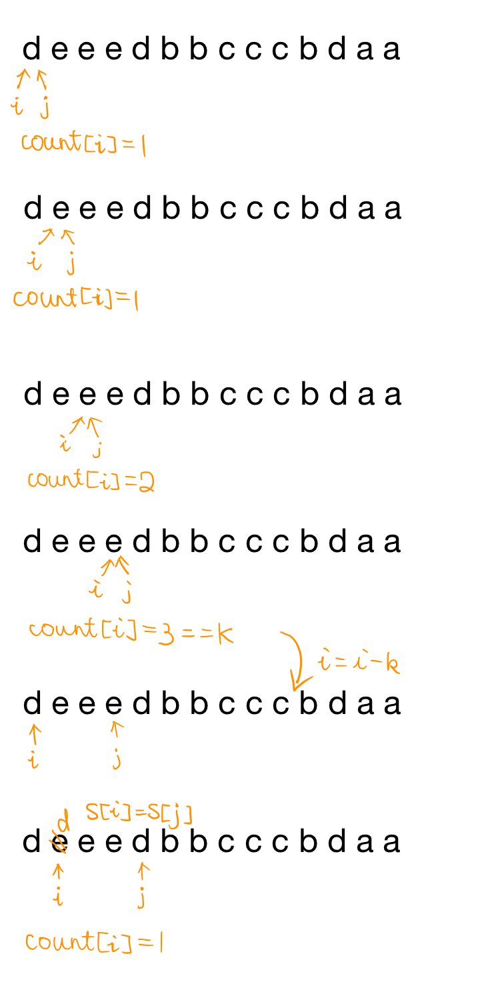

# 1209. Remove All Adjacent Duplicates in String II

- [x] 2020.04.22 Review


Given a string `s`, a *k* *duplicate removal* consists of choosing `k` adjacent and equal letters from `s` and removing them causing the left and the right side of the deleted substring to concatenate together.

We repeatedly make `k` duplicate removals on `s` until we no longer can.

Return the final string after all such duplicate removals have been made.

It is guaranteed that the answer is unique.

 

**Example 1:**

```
Input: s = "abcd", k = 2
Output: "abcd"
Explanation: There's nothing to delete.
```

**Example 2:**

```
Input: s = "deeedbbcccbdaa", k = 3
Output: "aa"
Explanation: 
First delete "eee" and "ccc", get "ddbbbdaa"
Then delete "bbb", get "dddaa"
Finally delete "ddd", get "aa"
```

**Example 3:**

```
Input: s = "pbbcggttciiippooaais", k = 2
Output: "ps"
```

 

**Constraints:**

- `1 <= s.length <= 10^5`
- `2 <= k <= 10^4`
- `s` only contains lower case English letters.


## Solution1

非常naive的stack做法

```cpp
class Solution {
public:
    string removeDuplicates(string s, int k) {
        vector<pair<char, int>> stack;
        vector<pair<char, int>> tmp;
        for(auto ch : s) {
            int sz = stack.size();
            if(sz == 0 || (sz > 0 && stack[sz - 1].first != ch)) {
                stack.push_back(make_pair(ch, 1));
            } else if(sz > 0 && stack[sz - 1].first == ch) {
                stack[sz - 1].second++;
                if(stack[sz - 1].second == k) {
                    stack.pop_back();
                }
            }
        }
        
        int stacksize = stack.size();
        int tmpsize = 0;
        int flag = 1;
        
        while(1) {           
            stacksize = stack.size();
            tmpsize = tmp.size();
            if(flag % 2 == 1) {
                for(auto p : stack){
                    int sz = tmp.size();
                    if(sz == 0 || (sz > 0 && tmp[sz - 1].first != p.first)) {
                        tmp.push_back(p);
                    } else if(sz > 0 && p.first == tmp[sz - 1].first) {
                        tmp[sz - 1].second += p.second;
                        if(tmp[sz - 1].second == k) tmp.pop_back();
                        else tmp[sz - 1].second -= k;
                    }
                } 
                stack.clear();
                if(stacksize == tmp.size()) break;
            } else {
                for(auto p : tmp){
                    int sz = stack.size();
                    if(sz == 0 || (sz > 0 && stack[sz - 1].first != p.first)) {
                        stack.push_back(p);
                    } else if(sz > 0 && p.first == stack[sz - 1].first) {
                        stack[sz - 1].second += p.second;
                        if(stack[sz - 1].second == k) stack.pop_back();
                        else stack[sz - 1].second -= k;
                    }
                } 
                tmp.clear();
                if(tmpsize == stack.size()) break;
            }
            flag++;
            
        }
        string res;
        
        if(stack.size()) {
            for(auto p : stack) {
                while(p.second > 0) {
                    res += p.first;
                    p.second--;
                }
            }
        } else {
            for(auto p : tmp) {
                while(p.second > 0) {
                    res += p.first;
                    p.second--;
                }
            }
        }
        return res;
        
    }
};
```


## Solution2

用stack。

其实不用solution1的while(1)循环。一次循环就能解决问题

```cpp
class Solution {
public:
    string removeDuplicates(string s, int k) {
        vector<pair<char, int>> st;
        
        for(auto ch : s) {
            if(st.size() == 0 || (st.size() > 0 && st.back().first != ch)) 
                st.push_back(make_pair(ch, 1));
            else {
                st.back().second += 1;
                if(st.back().second == k) st.pop_back();
            }    
        }      
        string res;
        for(auto &p : st)
            res += string(p.second, p.first);
        return res;
    }
};
```


## Solution3

双指针



```cpp
class Solution {
public:
    string removeDuplicates(string s, int k) {
        int i = 0, n = s.size();
        vector<int> count(n);
        
        for(int j = 0; j < n; ++j, ++i) {
            s[i] = s[j];
            if(i > 0 && s[i - 1] == s[i])
                count[i] = count[i - 1] + 1;
            else
                count[i] = 1;
            if(count[i] == k) i -= k;
        }
        return s.substr(0, i);
    } 
};
```


我觉得还是stack的做法比较自然。