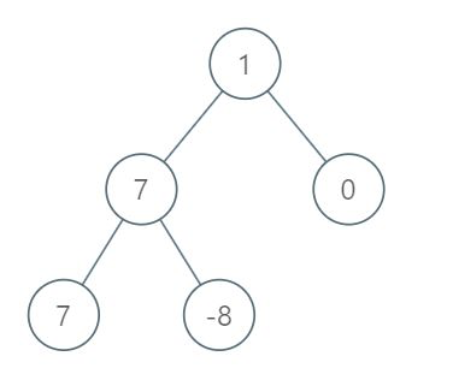

# 1161. Maximum Level Sum of a Binary Tree

Given the `root` of a binary tree, the level of its root is `1`, the level of its children is `2`, and so on.

Return the **smallest** level `X` such that the sum of all the values of nodes at level `X` is **maximal**.

 

**Example 1:**



```
Input: [1,7,0,7,-8,null,null]
Output: 2
Explanation: 
Level 1 sum = 1.
Level 2 sum = 7 + 0 = 7.
Level 3 sum = 7 + -8 = -1.
So we return the level with the maximum sum which is level 2.
```

 

**Note:**

1. The number of nodes in the given tree is between `1` and `10^4`.
2. `-10^5 <= node.val <= 10^5`

# Version1

总体思路是用层序遍历计算每层的和，然后找到最大和对应的层号

```cpp
class Solution {
public:
    
    int maxLevelSum(TreeNode* root) {
       return LevelOrder(root) ;
    }
    int LevelOrder(TreeNode* root) {
        if(root == NULL) return 0;
        queue<TreeNode*> q;
        q.push(root);
        vector<int> levelSum;
        int level = 0;
        while(q.size()) {
            int levelSize = q.size();
            int sum = 0;
            level++;
          //计算该层的和
            for(int i = 0; i < levelSize; i++) {
                TreeNode* top = q.front(); q.pop();
                sum += top->val;
                if(top->left) q.push(top->left);
                if(top->right) q.push(top->right);
            }
            levelSum.push_back(sum);
        }
      //找到最大level sum对应的level
        int maxIndex = -1;
        int maxSum = -10000000;
        for(int i = 0; i < level; i++) {
            if(levelSum[i] > maxSum) {
                maxSum = levelSum[i];
                maxIndex = i + 1;
            }
        }
        return maxIndex;
    }
};
```

