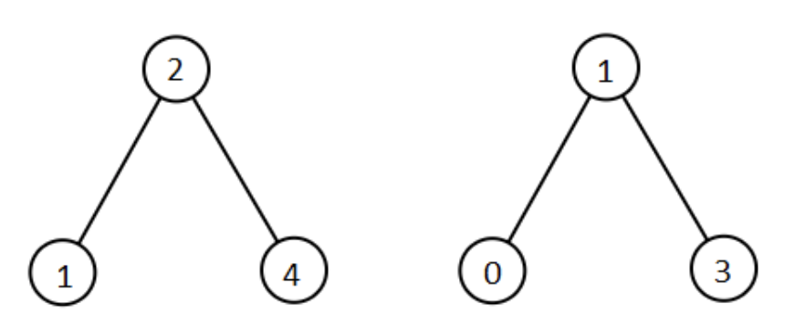
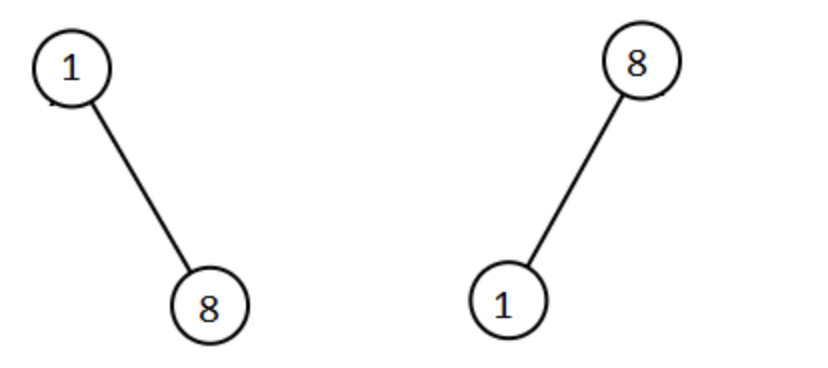

# 1305. All Elements in Two Binary Search Trees

Given two binary search trees `root1` and `root2`.

Return a list containing *all the integers* from *both trees* sorted in **ascending** order.

 

**Example 1:**



```
Input: root1 = [2,1,4], root2 = [1,0,3]
Output: [0,1,1,2,3,4]
```

**Example 2:**

```
Input: root1 = [0,-10,10], root2 = [5,1,7,0,2]
Output: [-10,0,0,1,2,5,7,10]
```

**Example 3:**

```
Input: root1 = [], root2 = [5,1,7,0,2]
Output: [0,1,2,5,7]
```

**Example 4:**

```
Input: root1 = [0,-10,10], root2 = []
Output: [-10,0,10]
```

**Example 5:**



```
Input: root1 = [1,null,8], root2 = [8,1]
Output: [1,1,8,8]
```

 

**Constraints:**

- Each tree has at most `5000` nodes.
- Each node's value is between `[-10^5, 10^5]`.

# Version1

很简单的遍历两棵树然后排序，时间效率比较差，因为要排序所以时O(nlogn)

```cpp
class Solution {
public:
    vector<int> res;
    void inorder(TreeNode* root) {
        if(root == NULL) return;
        inorder(root->left);
        res.push_back(root->val);
        inorder(root->right);
    }
    vector<int> getAllElements(TreeNode* root1, TreeNode* root2) {
        inorder(root1);
        inorder(root2);
        sort(res.begin(), res.end());
        return res;
    }
};
```

# Version2

<a href="http://www.myexception.cn/cpp/822575.html">reference</a>

这里没有排序。

中序遍历得到两个有序数组，只需要merge就好

```cpp
class Solution {
public:
    
    void inorder(TreeNode* root, vector<int>& res) {
        if(root == NULL) return;
        inorder(root->left, res);
        res.push_back(root->val);
        inorder(root->right, res);
    }
    vector<int> getAllElements(TreeNode* root1, TreeNode* root2) {
        vector<int> res1;
        inorder(root1, res1);
        vector<int> res2;
        inorder(root2, res2);
        vector<int> res;
        merge(res1.begin(), res1.end(), res2.begin(), res2.end(), back_inserter(res));
        return res;
    }
};
```

