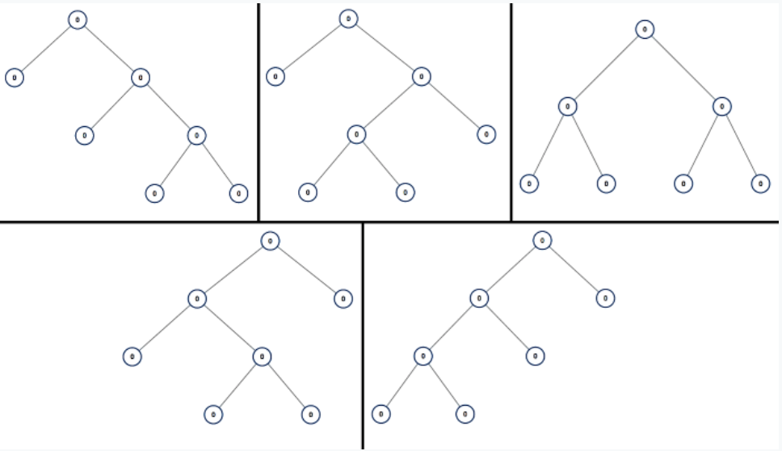

# 894. All Possible Full Binary Trees


A *full binary tree* is a binary tree where each node has exactly 0 or 2 children.

Return a list of all possible full binary trees with `N` nodes. Each element of the answer is the root node of one possible tree.

Each `node` of each tree in the answer **must** have `node.val = 0`.

You may return the final list of trees in any order.

 

**Example 1:**

```
Input: 7
Output: [[0,0,0,null,null,0,0,null,null,0,0],[0,0,0,null,null,0,0,0,0],[0,0,0,0,0,0,0],[0,0,0,0,0,null,null,null,null,0,0],[0,0,0,0,0,null,null,0,0]]
Explanation:
```

 

**Note:**

- `1 <= N <= 20`


# Version1

递归

```cpp
class Solution {
public:
    vector<TreeNode*> allPossibleFBT(int N) {
        vector<TreeNode*> res;
        if(N == 1) {	
            TreeNode* root = new TreeNode(0);
            res.push_back(root);
            return res;
        }
        for(int i = 1; i <= N - 1; i += 2) {
          	//得到节点数为i的满二叉树组合
            vector<TreeNode*> left(allPossibleFBT(i));
          	//得到节点数为N-i-1的满二叉树组合
            vector<TreeNode*> right(allPossibleFBT(N - i - 1));
            for(TreeNode* l : left) {
                for(TreeNode* r : right) {
                  	//创建根节点，组合左右子树
                    TreeNode* root = new TreeNode(0);
                    root->left = l;
                    root->right = r;
                    res.push_back(root);
                }
            }
        }
        return res;
    }
};
```


# Version2

```cpp
class Solution {
public:
    map<int, vector<TreeNode*> > mp;
    vector<TreeNode*> allPossibleFBT(int N) {
        if(!mp[N].size()) {
            vector<TreeNode*> res;
            if(N == 1) {
                TreeNode* root = new TreeNode(0);
                res.push_back(root);
            } else {
                for(int i = 1; i < N; i += 2) {
                    vector<TreeNode*> left(allPossibleFBT(i));
                    vector<TreeNode*> right(allPossibleFBT(N - i - 1));
                    for(TreeNode* l : left) {
                        for(TreeNode* r : right) {
                            TreeNode* root = new TreeNode(0);
                            root->left = l;
                            root->right = r;
                            res.push_back(root);
                        }
                    }
                }
            }
            mp[N] = res;
        }
        return mp[N];
    }
};
```


# Version3

```cpp
class Solution {
public:
    map<int, vector<TreeNode*> > mp;
    vector<TreeNode*> allPossibleFBT(int N) {
        vector<TreeNode*> first;
        TreeNode* root = new TreeNode(0);
        first.push_back(root);
        mp[1] = first;

        for(int i = 3; i <= N; i += 2) {
            vector<TreeNode*> res;
            for(int j = 1; j < i; j += 2) {
                vector<TreeNode*> left = mp[j];
                vector<TreeNode*> right = mp[i - j - 1];
                for(TreeNode* l : left) {
                    for(TreeNode* r : right) {
                        TreeNode* root = new TreeNode(0);
                        root->left = l;
                        root->right = r;
                        res.push_back(root);
                    }
                }
            }
            mp[i] = res;
        }
        return mp[N];
    }
};
```

